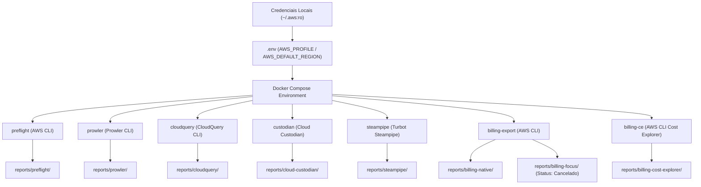

# AWS Account Audit Stack (Docker Compose)

Solução local, automatizada e segura baseada em **Docker Compose** para auditoria completa de contas AWS. O projeto realiza assessment de segurança, inventário de ativos, aplicação de políticas de governança, auditoria SQL de compliance e exportação de dados de bilhetagem (**AWS Data Exports / Standard CUR**).

Toda a stack executa sem guardar segredos em código, utilizando diretamente a cadeia de perfis locais da AWS (`~/.aws/credentials` e `~/.aws/config`).

---

## 🏛️ Arquitetura da Solução



---

## 📁 Estrutura de Saída dos Relatórios

Todos os relatórios são salvos em formato legível por máquina (JSON, CSV, SQLite, HTML) com timestamps para facilitar agrupamento posterior:

```text
reports/
  preflight/             # Validação de credenciais e identidade da conta AWS
  prowler/               # Assessment de segurança, postura e compliance (JSON, CSV, HTML)
  cloudquery/            # Inventário relacional da conta em SQLite (inventory.db)
  cloud-custodian/       # Relatórios de governança e otimização de custo (CSV, JSON)
  steampipe/             # Resultados de consultas SQL de compliance (CSV, JSON)
  billing-native/        # Metadados e status do AWS Data Exports (Standard CUR)
  billing-focus/         # Registro de status do padrão FOCUS (Desabilitado a pedido)
  billing-cost-explorer/ # Extração de faturamento do último trimestre via AWS Cost Explorer API (JSON, TXT)
```

---

## 🚀 Pré-requisitos

1. **Docker** e **Docker Compose** instalados e em execução.
2. **AWS CLI** instalado no host com perfis configurados em `~/.aws/credentials` e `~/.aws/config`.
3. Permissões de leitura na conta AWS (ex.: `ReadOnlyAccess` + `bcm-data-exports:ListExports` + `ce:GetCostAndUsage`).

---

## ⚙️ Configuração Inicial (AWS SSO / IAM Credentials)

### Se você utiliza autenticação com AWS SSO (Identity Center):

1. **Faça Login no Host Antes da Execução**:
   Antes de rodar a stack no Docker, execute o comando de login do SSO no terminal da sua máquina host:
   ```bash
   aws sso login --profile meu-perfil-sso
   ```
   *Por que isso funciona?* O comando do SSO gera os arquivos de token e cache em `~/.aws/sso/cache/`. Como montamos o diretório `${HOME}/.aws` inteiro nos containers em modo read-only (`:ro`), todas as ferramentas (AWS CLI, Prowler, CloudQuery, Cloud Custodian e Steampipe) leem essa sessão autenticada nativamente via AWS SDK!

2. **Configuração do `.env`**:
   Copie o exemplo e defina o nome exato do seu perfil SSO:
   ```bash
   cp .env.example .env
   ```
   No `.env`:
   ```ini
   AWS_PROFILE=meu-perfil-sso
   AWS_DEFAULT_REGION=us-east-1
   ```

3. **Validação**:
   Execute `make preflight` para confirmar que a sessão SSO ativa foi detectada corretamente.

---

## 🛠️ Comandos de Execução (Makefile)

| Comando | Descrição |
| :--- | :--- |
| `make preflight` | Valida credenciais AWS, `sts get-caller-identity` e permissões de escrita |
| `make up` | Valida a sintaxe da stack Docker Compose (`docker compose config`) |
| `make run-prowler` | Executa assessment de segurança com Prowler |
| `make run-cloudquery` | Executa sincronização de inventário com CloudQuery (SQLite) |
| `make run-custodian` | Aplica políticas de governança e otimização com Cloud Custodian |
| `make run-steampipe` | Executa consultas SQL de compliance com Steampipe |
| `make run-billing-export` | Verifica e gerencia o AWS Data Exports nativo |
| `make run-billing-ce` | Extrai histórico de faturamento dos últimos 90 dias via AWS Cost Explorer |
| `make run-all` | **Executa a suíte completa de auditoria sequencialmente** |
| `make down` | Limpa containers e redes residuais |
| `make clean` | Apaga relatórios e logs antigos |

---

## 📊 Detalhamento das Ferramentas

### 1. Preflight (`scripts/preflight.sh`)
Verifica se as credenciais AWS em `~/.aws` estão acessíveis, executa `aws sts get-caller-identity` e gera o arquivo `reports/preflight/preflight-<timestamp>.json` registrando a conta e ARN validados.

### 2. Prowler (`scripts/run-prowler.sh`)
Executa varredura baseada nos frameworks CIS Benchmark, SOC2 e PCI-DSS. Gera artefatos em `reports/prowler/` nos formatos HTML (para leitura humana), CSV e JSON (para análise por scripts/IA).

### 3. CloudQuery (`scripts/run-cloudquery.sh`)
Utiliza o arquivo `config/cloudquery.yml` para mapear recursos de rede, instâncias EC2, buckets S3, regras IAM e funções Lambda, persistindo a base relacional em `reports/cloudquery/inventory.db`.

### 4. Cloud Custodian (`scripts/run-custodian.sh`)
Avalia políticas definidas em `policies/custodian-governance.yml`. Gera relatórios em `reports/cloud-custodian/` identificando volumes EBS órfãos, IPs elásticos desocupados, instâncias sem tags e buckets S3 sem criptografia.

### 5. Steampipe (`scripts/run-steampipe.sh`)
Executa a suíte de consultas SQL declaradas em `queries/steampipe-audit.sql` utilizando a extensão AWS do Steampipe. Exporta os resultados tabulares diretamente para `reports/steampipe/`.

### 6. Billing Data Exports (`scripts/run-billing-export.sh`)
Interage com a API `bcm-data-exports` (ou fallback `cur`) para registrar o status das exportações ativas da conta em `reports/billing-native/`.
*Nota*: A exportação FOCUS 1.0 foi cancelada conforme diretriz de projeto, com o evento registrado formalmente em `reports/billing-focus/`.

### 7. Billing Cost Explorer (`scripts/run-billing-ce.sh`)
Executa consultas na API `aws ce get-cost-and-usage` para extrair a série temporal de custos do **último trimestre (últimos 90 dias / 3 meses)**. Salva relatórios detalhados agrupados por Serviço, Tipo de Uso (UsageType), Região e Tendência Diária em `reports/billing-cost-explorer/`.


---

## 🔍 Consolidação por Inteligência Artificial

Para processar os relatórios gerados e produzir um relatório consolidado com matriz de riscos e recomendações FinOps/SecOps, consulte as instruções contidas no guia [docs/ai-consolidation-guide.md](docs/ai-consolidation-guide.md) e as regras operacionais em [AGENTS.md](AGENTS.md).

---

## 📋 Checklist Final de Operação

- [x] O arquivo `.env` foi criado e configurado com o `AWS_PROFILE` correto.
- [x] O comando `make preflight` executou com sucesso exibindo o `Account ID` e `ARN`.
- [x] O arquivo `docker-compose.yml` foi validado com `make up`.
- [x] A execução de `make run-all` completou sem erros fatais.
- [x] Os diretórios em `reports/` possuem arquivos válidos com timestamp.
