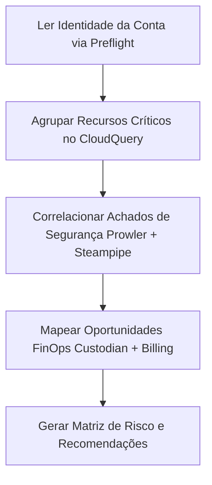

# Guia de Operação: Consolidação de Relatórios de Auditoria por IA

Este documento descreve as instruções e estruturas exigidas para que um modelo de IA (LLM / Agentic AI) leia, cruze e consolide os relatórios gerados por esta stack de auditoria AWS.

---

## 1. Mapeamento dos Artefatos de Entrada

O agente de IA responsável pela consolidação deve carregar os arquivos contidos em `reports/`:

1. **Preflight (`reports/preflight/*.json`)**:
   - Fornece metadados da conta (`account_id`, `arn`, `aws_region`, `timestamp`).
2. **Prowler (`reports/prowler/*.json`, `*.csv`)**:
   - Fornece achados de segurança por severidade (CRITICAL, HIGH, MEDIUM, LOW), conformidade com frameworks (CIS, SOC2) e ID dos recursos afetados.
3. **CloudQuery (`reports/cloudquery/inventory.db`)**:
   - Fornece o inventário estruturado e relacional de ativos AWS (buckets, VPCs, instâncias, IAM).
4. **Cloud Custodian (`reports/cloud-custodian/*.csv`, `custodian.log`)**:
   - Fornece desvios de governança, tags ausentes e oportunidades de otimização FinOps (EBS/EIP desocupados).
5. **Steampipe (`reports/steampipe/*.csv`, `*.json`)**:
   - Fornece resultados de regras específicas via SQL (chaves IAM antigas, Security Groups abertos para 0.0.0.0/0).
6. **AWS Billing (`reports/billing-native/*.json`, `billing-native-summary-*.txt`)**:
   - Fornece o status de configuração do AWS Data Exports (Standard CUR) e buckets S3 configurados.

---

## 2. Roteiro de Análise Cruzada (Cross-Analysis Pipeline)

A IA deve seguir a seguinte ordem de correlação ao analisar os dados:

### Regras de Correlação:
- **Segurança + Rede**: Se o Steampipe detectar uma porta 22 aberta em um Security Group, verifique no CloudQuery se a instância EC2 associada possui IP público e qual a severidade atribuída pelo Prowler.
- **Governança + Custo**: Se o Cloud Custodian sinalizar um volume EBS desanexado (`status: available`), cruze com os dados de billing para calcular o custo estimado de desperdício mensal.
- **IAM + Exposição**: Se o Prowler indicar um usuário IAM sem MFA, cruze com o Steampipe para verificar se o usuário possui chaves de acesso ativas criadas há mais de 90 dias.

---

## 3. Template de Saída Esperado para o Relatório Consolidado da IA

A IA consolidadora deve gerar um documento final contendo as seguintes seções:

### 1. Resumo Executivo
- Conta AWS ID e Região Principal
- Total de Recursos Inspecionados
- Score Geral de Postura de Segurança (%)
- Estimativa Mensal de Desperdício/Otimização (USD)

### 2. Matriz de Priorização de Riscos
| Nível | Recurso AWS | Problema Identificado | Ferramentas de Origem | Ação Recomendada |
| :--- | :--- | :--- | :--- | :--- |
| **CRÍTICO** | `sg-01234567` | Porta 22/SSH aberta para 0.0.0.0/0 | Prowler, Steampipe | Restringir CIDR |
| **ALTO** | `user-admin` | Chave IAM ativa há 120 dias sem MFA | Steampipe, Custodian | Rotacionar chave / Ativar MFA |
| **MÉDIO** | `vol-98765432` | Volume EBS não anexado (100GB gp3) | Cloud Custodian, CloudQuery | Excluir ou snapshot |

### 3. Plano de Ação por Pilar (Well-Architected Framework)
- **Segurança & Compliance**
- **Otimização de Custos (FinOps)**
- **Excelência Operacional & Governança**
